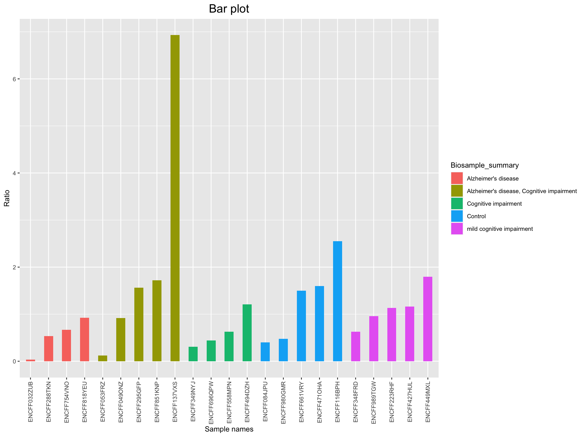
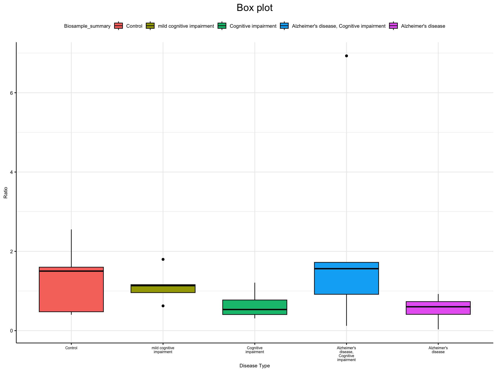

<!-- README.md is generated from README.Rmd. Please edit that file -->

# IsoformVisRNA

<!-- badges: start -->
<!-- badges: end -->

## Description

`IsoformVisRNA` is an R Package that generates plots to compare
transcript-level expression counts. It takes normalized count matrices
generated by kallisto and its corresponding metadata for its analysis.
This package have functions to generate figures like box plots and bar
plots to compare the expression ratios of various transcripts in a gene.
This package will improve the workflow in the analysis a gene’s
alternative splicing and help determine the dominant splicing pattern in
samples. The `IsoformVisRNA` package was developed using
`R version 4.3.1 (2023-06-16)`,
`Platform: x86_64-apple-darwin20 (64-bit)` and
`Running under: macOS Monterey 12.3.1`.

## Installation

To install the latest version of the package:

``` r
require("devtools")
devtools::install_github("hyunnaye/IsoformVisRNA", build_vignettes = TRUE)
library("IsoformVisRNA")
```

To run the Shiny app: Under construction

## Overview

    ls("package:IsoformVisRNA")
    data(package = "IsoformVisRNA") 
    browseVignettes("IsoformVisRNA")

`IsoformVisRNA` contains 4 functions to analyze the alternative splicing
for the desired gene in samples. The *combineCM* function combines all
kallisto count matrices to a single data frame. The *calculateRatios*
function calculates the expression ratios for the two given transcript
ids. The *generateBarPlot* generates a bar plot of the expression ratio
for each sample name ordered by samplename and given metadata group.
*generateBoxPlot* generates a box plot of the expression ratio for each
metadata group. An example output for the bar and box plot is shown
below.





## Contributions

The author of the package is Nayeon Hyun. The *combineCM* function uses
the tools package to remove extensions from filenames to generate the
column names. The *calculateRatios* function makes use of the `dplyr` R
package to filter and retrieve the counts for the desired transcript
ids. The *generateBarPlot* function makes use of the `ggplot2` R package
to generate its bar plot. The *generateBarPlot* function makes use of
the `ggboxplot` function in the `ggpubr` R package to generate its box
plot. This function also uses the `stringr` package to wrap the labels
to multiple lines in order to avoid overflowing labels.

## References

ENCODE Project Consortium.. An integrated encyclopedia of DNA elements
in the human genome. Nature 2012 Sep  
6;489(7414):57-74. PMID: 22955616

H. Wickham. ggplot2: Elegant Graphics for Data Analysis. Springer-Verlag
New York, 2016.

Kassambara A (2023). *ggpubr: ‘ggplot2’ Based Publication Ready Plots*.
R package version 0.6.0, <https://CRAN.R-project.org/package=ggpubr>.

R Core Team (2023). *R: A Language and Environment for Statistical
Computing*. R Foundation for Statistical Computing, Vienna, Austria.
<https://www.R-project.org/>.

Wickham H (2022). *stringr: Simple, Consistent Wrappers for Common
String Operations*. R package version 1.5.0,
<https://CRAN.R-project.org/package=stringr>.

Wickham H, François R, Henry L, Müller K, Vaughan D (2023). *dplyr: A
Grammar of Data Manipulation*. R package version 1.1.3,
<https://CRAN.R-project.org/package=dplyr>.

## Acknowledgements

This package was developed as part of an assessment for 2023 BCB410H:
Applied Bioinformatics course at the University of Toronto, Toronto,
CANADA. `IsoformVisRNA` welcomes issues, enhancement requests, and other
contributions. To submit an issue, use the [GitHub
issues](https://github.com/hyunnaye/IsoformVisRNA/issues). Many thanks
to those who provided feedback to improve this package.

## Package Structure

The package tree structure is provided below.

``` r
- IsoformVisRNA
  |- IsoformVisRNA.Rproj
  |- DESCRIPTION
  |- NAMESPACE
  |- LICENSE
  |- README
  |- data
    |- Experiment_info.rda
    |- Normalized_CM.rda
  |- inst
    |- extdata
      |- barplot.png
      |- boxplot.png
  |- man
    |- calculateRatios.Rd
    |- Experiment_info.Rd
    |- generateBarPlot.Rd
    |- generateBoxPlot.Rd
  |- R
    |- combineCM.R
    |- compare_expression.R
  |- tests
    |- testthat.R
    |- testthat
      |- test-calculateRatios.R
```
