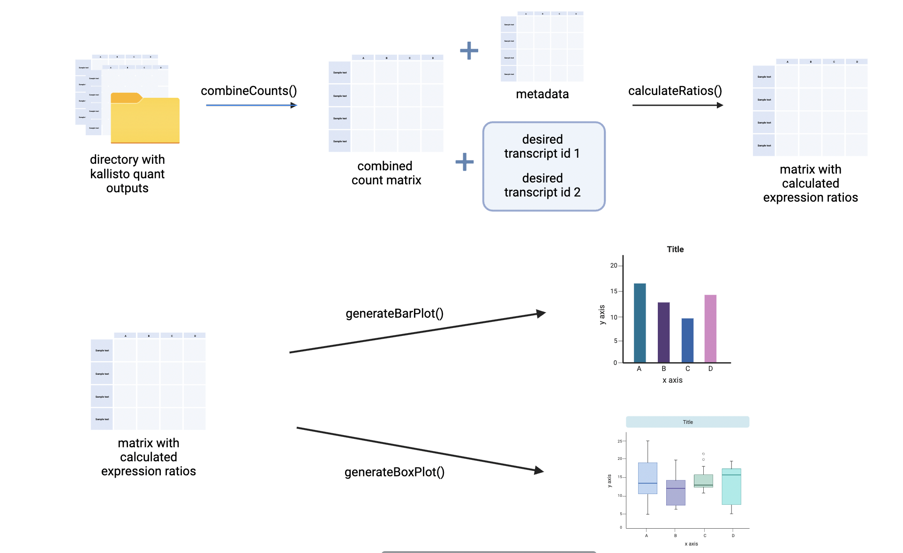

```{r, include = FALSE}
knitr::opts_chunk$set(
  collapse = TRUE,
  comment = "#>"
)
```

```{r setup}
library(IsoformVisRNA)
```

## Introduction

`IsoformVisRNA` is an R Package that generates plots to compare transcript-level expression counts. 
It takes normalized count matrices generated by kallisto and its corresponding metadata for its analysis.
This package have functions to generate figures like box plots and bar plots to compare the expression ratios of various transcripts in a gene.
This package will improve the workflow in the analysis a gene’s alternative splicing and help determine the dominant splicing pattern in samples.
The `IsoformVisRNA` package was developed using `R version 4.3.1 (2023-06-16)`, `Platform: x86_64-apple-darwin20 (64-bit)` and `Running under: macOS Monterey 12.3.1`. See `help(package = "TestingPackage")` for further details. 
Below is a flowchart demonstate the workflow of this package.


To download **IsoformVisRNA**, use the following commands:

``` r
require("devtools")
devtools::install_github("hyunnaye/IsoformVisRNA", build_vignettes = TRUE)
library("IsoformVisRNA")
```
To list all sample functions available in the package:
``` r
ls("package:IsoformVisRNA")
```

To list all sample datasets available in the package:
``` r
data(package = "IsoformVisRNA")
```

<br>


### Minimal requirements

* You will need to generate transcript-level count matrices in tsv format using kallisto. Then, you will need to have all the kallisto tsv files in a single folder. You will also need a metadata file containing details for your dataset.

## Functions

*combineCounts* combines all kallisto count matrices to a single data frame.
To get more information about *combineCounts* function, the help documentation will helpful:
```{r, }
library(IsoformVisRNA)
?IsoformVisRNA::combineCounts
``` 

*calculateRatios* function generates expression ratios for 2 given transcript ids for all samples.
To get more information about *calculateRatios* function, view the help documentation:
```{r, }
library(IsoformVisRNA)
?IsoformVisRNA::calculateRatios
``` 

To create plots like bar plots and box plots to compare your desired expression ratios, you can use *generateBarPlot* and *generateBoxPlot*.
```{r, }
library(IsoformVisRNA)
?IsoformVisRNA::generateBarPlot
``` 

```{r, }
library(IsoformVisRNA)
?IsoformVisRNA::generateBoxPlot
``` 

You can also generate plots using the Shiny app. To launch the shiny app:
```{r, }
library(IsoformVisRNA)
IsoformVisRNA::runIsoformVisRNA()
``` 

### Workflow
In the following session, I will demonstate the use of **IsoformVisRNA** by to compare the two ENSEMBL transcript IDs, ENST00000316724.9 and ENST00000409400.1.

### Step 1: Combining all Kallisto matrices into one using combineCounts.
After fulfilling the minimal requirements of this package and generating kallisto counts, the first step will be to combine all the matrices into a single count matrix. 
This is done using the combineCounts function. There is only one argument for this function which is the path to the directory that contains the kallisto tsv outputs.


``` {r, }
# combine all kallisto counts into a matrix called normCM
combinedCM <- combineCounts("<path to the directory containing your kallisto outputs>")

```

### Step 2: Calculate ratios to compare expression of two transcript IDs with calculateRatios().
Now, we can calculate ratios for isoform expression analysis using the function, calculateRatios(). This function generates expression ratios for 2 given transcript ids for all samples.

This function takes 5 arguments plus an optional argument if you want to save the output to a csv.

The first argument is normCM, which takes the matrix you generated in step 1.
The second argument is metadata, which is the matrix that has your metadata information. If your metadata is in a tsv or csv, you will need to read it using read.csv() or read.tsv().
The 3rd and 4th arguments are your two desired transcript ids for comparison. 
The computed ratios will be transcript_id2 : transcript_id1.
The fifth argument is metadata_group, which is the column in the metadata matrix, that you want to group your samples by.
Lastly, the final argument is optional, which is the output_path. If you want to save the computed ratio data into a csv file, you can add a path to this argument. Note, to use our shiny app, this argument is required.

``` {r, }
# calculate expression ratios for ENST00000316724.9 and ENST00000409400.1 without saving to a CSV.
ratioDF <- calculateRatios(Normalized_CM, Experiment_info, "ENST00000316724.9", "ENST00000409400.1", "Biosample_summary")

# calculate expression ratios for ENST00000316724.9 and ENST00000409400.1 and save to a CSV to use with the shiny app.
ratioDF <- calculateRatios(Normalized_CM, Experiment_info, "ENST00000316724.9", "ENST00000409400.1", "Biosample_summary", "./ratioDF.csv")

```
### Step 3: Generate bar plots and box plots

Now we are ready to generate our plots!

To create a bar plot, generateBarPlot() can be used.
It takes 1 required argument and 3 optional arguments.
The first argument is data, which takes the matrix you generated in step 2.
The 2nd and 3rd arguments are x-label and y-label, which are the names you want your x-axis and y-axis to be. This is optional and will be blank if not set.
The last argument is the title for your plot. This is also optional and will be NULL and blank if not set. 

``` {r, }
# generate bar plot
generateBarPlot(ratioDF, "Sample names", "Ratio", "Bar plot")

```

To create a box plot, generateBoxPlot() can be used. This function will combine samples in the same metadata_group from the output of step 2 and create boxes for each group. 
It has 1 required argument and 4 optional arguments.
The first argument is data, which takes the matrix you generated in step 2.
The 2nd and 3rd arguments are x-label and y-label, which are the names you want your x-axis and y-axis to be. This is optional and will be blank if not set.
The 4th argument is the title for your plot. This is also optional and will be NULL and blank if not set. 
The last argument takes a list to specify the desired order for the boxes of your plot. This is optional, and will be ordered automatically if not set. If you want the boxes to be in a specific order, all group names must be included in the list.

``` {r, }
# generate box plot without custom ordering
generateBoxPlot(ratioDF, "Disease Type", "Ratio", "Box plot")

# generate box plot with specific ordering
generateBoxPlot(ratioDF, "Disease Type", "Ratio", "Box plot",
     c("Control", "mild cognitive impairment", "Cognitive impairment",
     "Alzheimer's disease, Cognitive impairment", "Alzheimer's disease"))

```


## Package References

- Hyun, N. (2023) IsoformVisRNA: Isoform Visualizer for RNA-seq. 
  Unpublished. https://github.com/hyunnaye/IsoformVisRNA

<br>

## Other References

  ENCODE Project Consortium.. An integrated encyclopedia of DNA elements in the human genome. Nature 2012 Sep 6;489(7414):57-74. PMID: 22955616
  
  H. Wickham. ggplot2: Elegant Graphics for Data Analysis. Springer-Verlag New York, 2016.
  
  Kassambara A (2023). _ggpubr: 'ggplot2' Based Publication Ready Plots_. R package version 0.6.0,
  <https://CRAN.R-project.org/package=ggpubr>.
  
  R Core Team (2023). _R: A Language and Environment for Statistical Computing_. R Foundation for Statistical
  Computing, Vienna, Austria. <https://www.R-project.org/>.
  
  Wickham H (2022). _stringr: Simple, Consistent Wrappers for Common String Operations_. R package version
  1.5.0, <https://CRAN.R-project.org/package=stringr>.
  
  Wickham H, François R, Henry L, Müller K, Vaughan D (2023). _dplyr: A Grammar of Data Manipulation_. R
  package version 1.1.3, <https://CRAN.R-project.org/package=dplyr>.
  
----

```{r}
sessionInfo()
```
